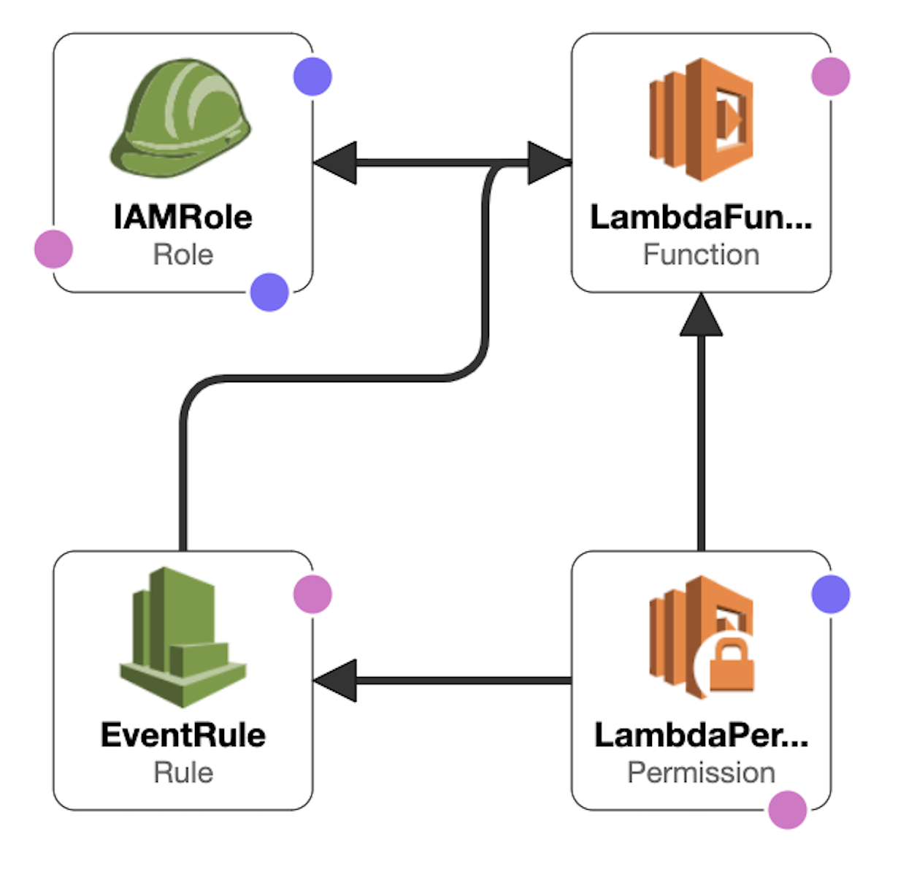

# AWS Well-Architected Auto-Deployment

Auto-deployment of the Lambda function that collects AWS Well-Architected data and sends them to Logz.io in bulks over HTTP.

## Getting Started

To start just press the button and follow the instructions:

You'll be taken to AWS, where you'll configure the resources to be deployed. Keep the defaults and click Next:

Fill in all the stack parameters and click **Next**:

| Parameter | Description |
| --- | --- |
| CloudWatchEventScheduleExpression | `Default: rate(10 hours)` The scheduling expression that determines when and how often the Lambda function runs. |
| LogzioToken | Your Logz.io account token. (Can be retrieved on the Settings page in the Logz.io UI.) |
| LogzioURL | The Logz.io listener URL. If you are in the EU region choose https://listener-eu.logz.io:8071. Otherwise, choose https://listener.logz.io:8071. (You can tell which region you are in by checking your login URL - app.logz.io means you are in the US, and app-eu.logz.io means you are in the EU.) |

On the following screen, fill Tags to easily identify your resources and press **Next**:

On the final screen, AWS will automatically show a notice requesting that you acknowledge that AWS CloudFormation might create IAM resources. Check the box and click **Create Stack**:

## Resources

This auto-deployment will create the following resources in your AWS account:

| Resource Type | Resource Name |
| --- | --- |
| AWS::IAM::Role | LogzioAWSCostAndUsage |
| AWS::Lambda::Function | logzio-aws-cost-and-usage |
| AWS::Events::Rule | LogzioAWSCostAndUsage |
| AWS::Lambda::Permission | - |

## Searching in Logz.io

All logs that were sent from the lambda function will be under the type `billing` 
